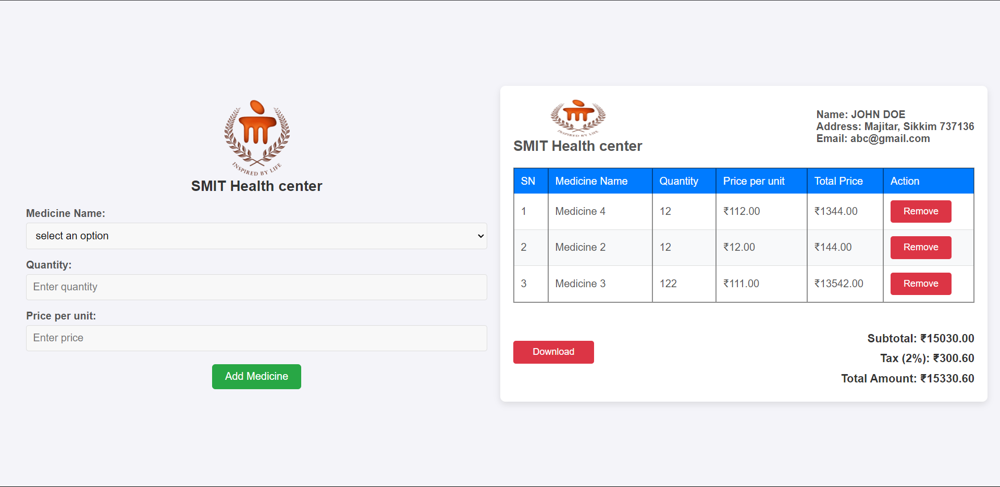

<!DOCTYPE html>
<html lang="en">
<head>
    <meta charset="UTF-8">
    <meta name="viewport" content="width=device-width, initial-scale=1.0">
    <title>Medicine Billing System - README</title>
    
</head>
<body>
    

        <h1>Medicine Billing System</h1>
        
This project is a <strong>Medicine Billing System</strong> designed to simplify and automate the management of medicine purchases and billing at a healthcare facility.

        

            <h2>Features</h2>
            <ul>
                <li><strong>Add Medicines:</strong> Select from predefined options and input the quantity and unit price for billing.</li>
                <li><strong>Automated Calculations:</strong>
                    <ul>
                        <li>Subtotal amount calculation based on quantity and price.</li>
                        <li>Automatic tax calculation (2%).</li>
                        <li>Total amount update with tax.</li>
                    </ul>
                </li>
                <li><strong>Remove Items:</strong> Option to remove medicines from the bill.</li>
                <li><strong>Download Invoice</strong> (Functionality placeholder).</li>
            </ul>
        

        

            <h2>Project Structure</h2>
            <pre>
├── index.html     # Main HTML structure for the Medicine Billing System.
├── style.css      # CSS file for styling the layout and components.
├── script.js      # JavaScript file for functionality (adding/removing medicines, updating totals).
            </pre>
        

        

            <h2>File Details</h2>
            <ul>
                <li><strong>index.html:</strong> Provides the structure of the system, including input forms and a billing table.</li>
                <li><strong>style.css:</strong> CSS styles for the layout and user interface.</li>
                <li><strong>script.js:</strong> JavaScript logic for adding, removing, and updating medicines.</li>
            </ul>
        

        

            <h2>Installation</h2>
            
Clone the repository:

            <pre><code>git clone https://github.com/your-username/medicine-billing-system.git</code></pre>

            
Navigate into the project directory:

            <pre><code>cd medicine-billing-system</code></pre>

            
Open the index.html file in a browser:

            <pre><code>open index.html</code></pre>
        

        

            <h2>Usage</h2>
            <ol>
                <li>Select a <strong>medicine</strong> from the dropdown menu.</li>
                <li>Enter the <strong>quantity</strong> and <strong>price per unit</strong>.</li>
                <li>Click <strong>Add Medicine</strong> to add the item to the bill.</li>
                <li>View the <strong>subtotal, tax</strong>, and <strong>total</strong> in real-time.</li>
                <li>Use the <strong>Remove</strong> button to delete an item if needed.</li>
            </ol>
        

        

            <h2>Preview</h2>
            

        

        

            <h2>Future Improvements</h2>
            <ul>
                <li><strong>Download functionality:</strong> Implement a feature to download the invoice.</li>
                <li><strong>Database integration:</strong> Store invoices and medicines in a database.</li>
                <li><strong>Client details form:</strong> Allow input of dynamic client information.</li>
            </ul>
        

    

</body>
</html>
